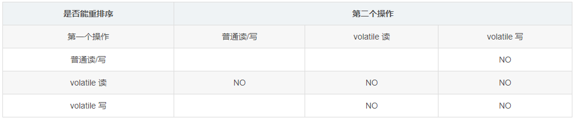

## volatile
#### 多线程三大特性
* 原子性
    * 指一个操作是不可中断的。即使是在多个线程一起执行的时候，一个操作一旦开始，就不会被其他线程干扰。
    * eg: 原子性，指的是不可分割的整体。比如，一个累加的操作分为三步：从内存读取值、值加1、结果写回内存。这个操作要么发生，要么不发生，不会只进行到中间，而跑去干其他事情。

* 可见性
    * 一个线程修改了某一个共享变量的值时，其他线程能立即知道这个修改。
    * eg: 两位同学同时拉取的git代码，并对相同地方进行了修改。两人之间是不知道对方的修改的，这时就会产生冲突。
* 有序性
    * 保证代码从前往后，按照串行语义那样正确的执行下去。
    * eg: 有序性产生的原因是程序执行时，会指令重排。
    ``` java
    1  boolean flag = true;
    2  int a = 1;
    ```
    以上代码之间相互不影响，指令重排之后，有可能2会在1之前执行。
    * eg: 指令流水线的原理，也是指令重排的效果，提升了CPU处理的性能。
#### **Happen-Before规则**
     1、程序顺序规则：一个线程内保证语义的串行性。
     2、volatile： volatile变量的 写 发生在 读 之前，保证了volatile变量的可见性。
     3、锁规则：unlock 必然发生在对同一 lock 之前。（如果对同一把锁进行解锁后，再加锁。那么加锁的动作不能发生在解锁之前。）
     4、传递性：A先于B,B先于C，则A必然先于C。
     5、线程的start() 方法先于它的每一个操作。
     6、线程的每一个操作先于线程的终结（Thread.join()）。
     7、线程的中断（interrupt()）先于被中断的线程代码。
     8、对象的构造函数的执行和结束 先于finalize()方法。
#### JMM
* Java内存模型，是Java虚拟机规范中用来定义一个一致性的、跨平台的内存模型。是缓存一致性协议，用来定义数据读写的规则。
* **为什么会有JMM？** 在计算机中，CPU指令的速度远超过内存的读取速度，为了不浪费CPU的速度提高效率，在CPU和内存之间加了一层缓冲-高速缓存（Cache）。但是这个解决方法引入了一个新的问题-缓存一致性。
<div align=center>
    
</div>


 * JMM规定
    * 所有的共享变量都储存在主内存（类变量和实例变量）。局部变量是线程私有的。    
    * 线程对共享变量的所有操作（读、取、修改）都必须在自己的工作内存中，不允许直接操作主内存。
    * 不同线程之间不能直接访问对方工作内存中的变量，需要通过主内存来进行线程通信。
    <small> 注：由于上述规定，引申出了线程之间可见性的问题。</small>
  <div align=center>
    
  </div>


* 可见性的解决方法：
    * 加锁：线程获取锁的同时，会情况本地工作内存，然后从主内存拷贝最新副本到本地。
    * volatile 修饰共享变量
    * final 修饰的字段（只要this引用没有逃逸，那其他线程也能看到final修饰的值）
#### volatile 关键字
* 轻量级的线程安全机制：保证了**可见性，禁止指令重排，不保证原子性**。
    * 可见性：
      当一个线程从主内存读取数据到自己的工作内存并修改写回了数据。那么其他线程已经读取的变量副本都会失效，需要重新去主内存读取最新的变量值。（Java虚拟机实现volatile时，是写入了一条lock前缀的汇编指令。这条指令会强制写入主存，也可避免前后指令的重排序，并及时让其他核中的相应缓存行（CPU高速缓存中可以分配的最小的存储单位，处理器填写缓存行时会加载整个缓存行。）失效，从而利用MESI达到可见性的效果。）
        * lock指令作用1：将当前处理行的数据写回主存。
        * lock指令作用2：时其他CPU里的缓存无效，下次访问相同内存地址时，将强制执行缓存行填充。
    * 禁止指令重排：
    Java编译器会在生成指令时，在合适的位置插入**内存屏障**指令来禁止指令重排。
  <div align=center>
    
  </div>

    * 当第二个操作是volatile 写时，不管第一个操作是什么，都不能重排序。这个规则确保volatile 写之前的操作不会被编译器重排序到volatile 写之后。**PS: v-写之后，会将其他线程缓存失效。所以其他线程重排到v-写后，会丢失操作，改变语义。**
      <div align=center>
         
      </div>
    * 当第一个操作是volatile 读时，不管第二个操作是什么，都不能重排序。这个规则确保volatile 读之后的操作不会被编译器重排序到volatile 读之前。**PS:v-读时是从主内存重新拷贝最新的副本。所以如果其他线程操作重排到v-读之前，会增加其他线程操作的值，改变了语义。**
      <div align=center>
        
      </div>
    * 当第一个操作是volatile 写，第二个操作是volatile 读时，不能重排序。
#### 适用场景
* volatile修饰符适用于以下场景：某个属性被多个线程共享，其中有一个线程修改了此属性，其他线程可以立即得到修改后的值，比如booleanflag;或者作为触发器，实现轻量级同步。
* volatile属性的读写操作都是无锁的，它不能替代synchronized，因为它没有提供原子性和互斥性。因为无锁，不需要花费时间在获取锁和释放锁_上，所以说它是低成本的。
* volatile只能作用于属性，我们用volatile修饰属性，这样compilers就不会对这个属性做指令重排序。
* volatile提供了可见性，任何一个线程对其的修改将立马对其他线程可见，volatile属性不会被线程缓存，始终从主 存中读取。
* volatile提供了happens-before保证，对volatile变量v的写入happens-before所有其他线程后续对v的读操作。
* volatile可以使得long和double的赋值是原子的。
* volatile可以在单例双重检查中实现可见性和禁止指令重排序，从而保证安全性。

```java 
/**
 * volatile 用于双重检查时的例子.
 *
 * @author Leeds, 2021-07-09
 * @version Lee v1.0.
 */
public class SingleInstance {

    /**
     * 因为new对象的操作为：
     * 1、分配内存空间
     * 2、调用构造器，初始化实例
     * 3、返回地址给引用
     *  其中2和3可能出现指令重排。在多线程环境下，就有可能出现，还未构造完成就返回引用的情况。虽然 singleInstance判断上不为空，但实际
     *  使用singleInstance中的方法就会NPE。
     */
    static volatile SingleInstance singleInstance = null;

    private SingleInstance(){

    }

    /**
     * 双重检查单例
     * @return
     */
    public static SingleInstance getInstance(){
        // 第一次检查，没有初始化的才加锁生成。提高了效率。
        if(Objects.isNull(singleInstance)){
            synchronized (SingleInstance.class){
                // 防止出现 多线程时，第一次检查同时为null，重复创建对象。
                if(Objects.isNull(singleInstance)){
                    singleInstance = new SingleInstance();
                }
            }
        }
        return singleInstance;
    }

}
```