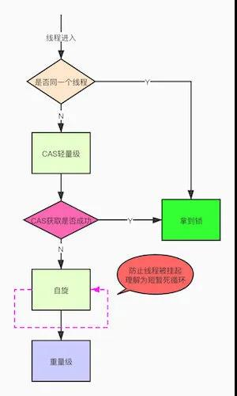

## synchronized
#### 锁的对象
    * 修饰实例方法，对当前对象的this加锁
    * 修饰静态方法，对当前class类对象加锁
    * 修饰代码块，对括号内对象加锁
#### 底层原理
    * 实现的基础，Java中的每个对象都可以作为锁，synchronized的锁存在于Java对象头里。JVM基于进入和退出Monitor对象来实现同步。    
    * monitorenter指令在编译后插入到同步代码块的开始位置，monitorexit插入到代码结束和异常位置。保证一个monitorente有一个monitorexit对应（所以synchronized能自动加解锁）。
    * 对象头--> Mark Word：储存了分代年龄和锁标志位等同步信息。
#### 特性
    * 原子性
    * 可见性
    * 有序性
    * 可重入性：锁对象有个计数器，相同线程进入就会加1，执行完成就减1，直到减为0，锁就被释放了。
        * 可重入锁：某个线程已经获得某个锁，可以再次获取锁而不会出现死锁。
    * 不可中断性：一个线程获取锁后，另外的线程只能阻塞或者等待。（与之对应的Lock.trylock方法是可中断的）
#### synchronized 锁升级过程
    无锁 >> 偏向锁 >> 轻量级锁 >> 重量级锁

    

    都是为了更高的效率
