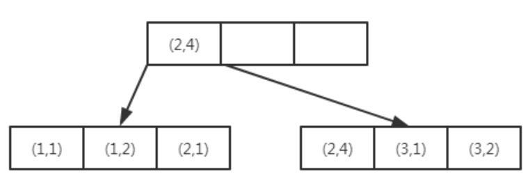

### 数据库索引

#### 索引用来解决什么问题

提升查找效率，类似于字典的目录。一般数据量大，查询又慢的情况就适合加索引。

#### 索引底层实现

> 二叉查找树==>平衡二叉树==>B-树==>B+树

- 二叉树
  - 非叶子节点最多拥有两个子节点
  - 非叶子节点值大于左边子节点、小于右边字节点
  - 没有值相等的重复节点

> 因为二叉查找树可以任意的构造，如果二叉查找树退化成链式的结构，其查找效率就和顺序查找差不多了。所以为了提升二叉树的查找效率，需要二叉树是平衡的，引出了平衡二叉树。

- 平衡二叉树
  - 需要满足二叉树以上三个特性
  - 树的左右两边的层级数相差不会大于1

> 平衡二叉树查找效率很快，但是维护成本很高。如果插入或者更新数据，需要1次或者多次左旋或右旋来保证平衡性。如果数据多了，查询成本会随树高的增加而增加。

- B-树和B+树
  - B树结构

> B-树在一个节点可以存储多个数据，相对于平衡二叉树储存相同数据树会“矮”很多。所以查询次数（IO次数）会减少很多。

- B+树

> 在B-树的基础上每个非叶子节点冗余了数据在叶子节点中。
>
> 非叶子节点是主键，占用空间小，存放的数据就更多。
>
> 叶子节点和后序节点相连接，对范围查找非常有用。

[^undefined]:频繁的IO是阻碍提高性能的瓶颈，局部性原理可以明显减少IO。**时间局部性原理**：查询过的数据很大程序上还会继续查询，所以会将这部分数据缓存下来。**空间局部性原理**：当你查询ID为1的数据时，很大概率你还会查询2、3、4的数据，所以会把ID为1、2、3、4的数据一起读到内存中去，每次读取的最小单位就是页。所以，B+树中的一个节点设置为1页或者倍数比较合适。

#### 索引分类

- 聚集索引和联合索引

  - 聚集索引：物理顺序与列值（一般是主键）的逻辑顺序相同，一个表中只能拥有一个。

    

  - 非聚集索引：逻辑顺序与磁盘物理顺序不同，一个表可以拥有多个。

    

    > 非聚集索引查询方式：先在索引上找到对应的主键，主键再去查找记录。这个过程也叫做**回表**。

  - 联合索引：表上多个列进行索引。

    对（a,b）进行索引，数据按照a，b的顺序进行了排序存放

    

    > 由以上可知，（a,b）和单独 a可以使用到索引。而b则不能使用，因为b列是无序的。

#### 回表和覆盖索引

- Oracle回表：查询数据时，先匹配到索引，索引再获取该行的rowid，根据rowid在查询表中数据。

- Mysql回表：查询数据时，先匹配到索引，索引再获取该行的主键ID，根据主键ID在查询表中数据。

  > mysql  非聚集索引存放了 被索引值 和 主键id。
  > Oracle 非聚集索引存放了 被索引值 和 rowid。

- 查询数据时，可以利用索引中返回的数据，而不必根据索引再次查询。包含所有满足查询需要的索引就是**覆盖索引**。

  > 例如，需要根据a，b查询c。则可以建立联合索引（a,b,c）。运行select c from table where a and b，
  >
  > 就可以直接从索引中获取c列。

#### 哪些情况适合设置索引

​	区分度查询：select count(distinct 列) / count(*)  from table。

​	当超过80的时候就值得设置索引。

​	当建立联合索引时，将数值大的放在第一位效率最好。

#### 索引失效和建议使用的场景

- 在索引上进行运算或使用函数（=左边）

- 隐式类型转换（=左边）

- 前导模糊查询（%参数）

- #### 最左匹配原则

  > 在联合索引中，索引只能查找key是否存在（相等），遇到范围查询（<,>,between,like左匹配）等就不能进一步匹配，会退化为线性查找。因此，排列顺序决定了可命中索引的列数。

  

  - 将区分度最高的字段放在最左边

  - 查询时可以乱序，比如联合索引（a,b,c): where a and b and c 和 where c and b and a 效果一致，数据库会优化顺序

  - 避免filesort：所有不是直接通过索引返回排序结果的操作。

    > mysql中有两种有序结果集：
    >
    > 1. 通过有序索引顺序扫描直接返回有序数据 
    > 2. Filesort排序，对返回的数据进⾏排序

- union，or，in都能命中索引，建议使⽤in

- 负向条件索引(!=、<>、not in、not exists、not like)不会使用索引，建议使用in

- 建立覆盖索引

- 经常修改，区分度不高的列不宜加索引

- 明确只返回一条记录，可以使用limit，让MySQL停止游标移动

- 对文本建立前缀索引，可以参考下一节索引列太长的解决办法

- 建立索引的列不为NULL:null值不会包含在索引中，复合索引只要有一列为null，则复合索引无效

#### 索引列太长的解决办法

1. 改用哈希索引
   - 将过长的列哈希成固定长度作为索引，表中新建一列B储存哈希码。哈希索引中储存哈希码和指向每个数据行的指针。哈希冲突时，使用链表法。
   - 查询时条件必须B和A。带上A是为了解决hash冲突时对比。
   - 存储原理和hashmap类似。
2. 前缀索引
   - 使用区分度查询，找出区分度最高的作为索引。如邮箱的前缀区分度最高。
   - 缺点：无法order by和group by,也无法覆盖扫描。

#### mysql执行计划解释

#### Oracle索引跳跃式扫描

在where条件中没有对目标索引的前导列指定查询条件但同时又对该 索引的非前导列指定了查询条件的目标SQL依然可以用上该索引，这就像是在扫描该索引时跳过了它的前导列，直接从该索引的非前导列开始扫描一样。

Oracle对前导列所有distinct值做了遍历，例如：

> 建立一个索引（a,b）；
>
> a列只有‘F’和‘M’两个值，b是一个订单号；
>
> 查询select * from table where b；
>
> Oracle会将上面查询语句优化成：
>
> select * from table where a = 'F' where b
>
> union all
>
> select * from table where a = 'M' where b;

仅仅适合目标索引前导列的distinct值数量较少、后续非前导列的可选择性又非常好的情形