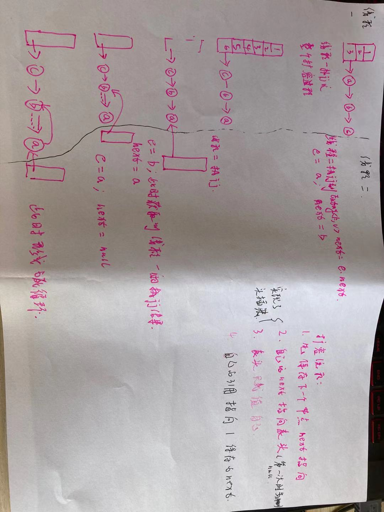

### HashMap的死循环问题（1.7 头插法）

1. 扩容代码的流程

   ```java
   voidtransfer(Entry[] newTable, booleanrehash) {
   intnewCapacity=newTable.length;
   for (Entry<K,V>e : table) {
   while(null!=e) {
   Entry<K,V>next=e.next; // 线程1执⾏完这⼀句被挂起
   if (rehash) {
   e.hash=null==e.key?0 : hash(e.key);
               }
   inti=indexFor(e.hash, newCapacity);
   e.next=newTable[i];
   newTable[i] =e;
   e=next;
           }
       }
   }
   ```

   > 步骤5：先保存下一个节点的数据，用next引用指向e的下一节点。
   >
   > 步骤10：e节点的next指向**新**表头（第一次执行的时候表头为null，即指向null。表头有数据时候，其实相当于把e插到数据之前）。
   >
   > 步骤11：**新**表头赋值e。（表头就指向了e,这里配合步骤10即完成了头插。)
   >
   > 步骤12：e赋值步骤5保存下来的数据next。（配合步骤4while循环完成链上数据的遍历）

2. 死循环问题

   发生在多线程扩容时候。例如，两个线程，扩容时都会新建数组。

   - 线程2执行到了Entry < K,V > next = e.next，即上面的步骤5，时间片用完，程序开始执行线程1。
   - 线程1执行完扩容流程，但是还没有将新数组赋值给HashMap的内部数组，时间片用完，程序开始执行线程2。

   

<!--参考链接：https://www.jianshu.com/p/1e9cf0ac07f4 -->

